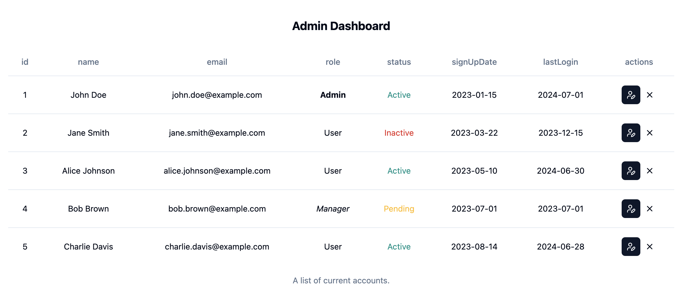

# Admin Dashboard

## Overview

This is an administration dashboard that manages accounts. The main interface displays each account's `id`, `name`, `email`, `role`, `status`, `signUpDate`, and `lastLogin`, and provides control options of deleting or editing each single piece of data.

### Screenshot of the main interface.

### Screenshot of the Delete modal

### Screenshot of the Edit User modal

## Libraries

UI framework - `vite` + `React` + `TypeScript` \
UI library - `shadcn` \
Styling library - `tailwind css`